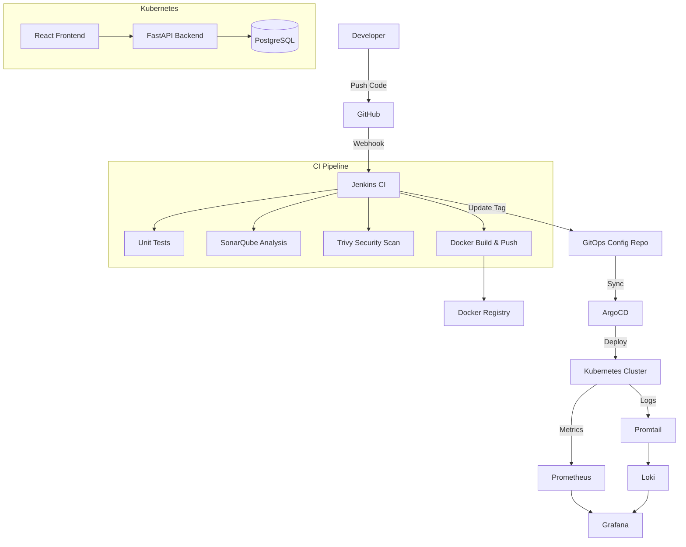

# DevOps Incident Tracker

> **Automated CI/CD, Containerization, Kubernetes Deployment and Monitoring Platform**

This is a complete DevOps capstone project demonstrating modern software delivery practices. It revolves around a simple web-based IT Incident Tracker application built with React and FastAPI, but its primary focus is on the automated CI/CD pipeline, infrastructure, deployment, and monitoring.

## 📋 Table of Contents
1. [Project Overview](#project-overview)
2. [Objectives](#objectives)
3. [Architecture](#architecture)
4. [Technology Stack](#technology-stack)
5. [Repository Structure](#repository-structure)
6. [Local Development](#local-development)
7. [DevOps Pipeline](#devops-pipeline)
   - [Docker & Containerization](#docker--containerization)
   - [Jenkins CI/CD](#jenkins-cicd)
   - [Code Quality & Security](#code-quality--security)
   - [Kubernetes & Helm](#kubernetes--helm)
   - [GitOps with ArgoCD](#gitops-with-argocd)
8. [Monitoring & Logging](#monitoring--logging)
9. [Infrastructure as Code](#infrastructure-as-code)

---

## 🎯 Project Overview
The Incident Tracker application allows users to create, view, update, search, filter, and resolve IT incidents. The application is intentionally kept simple to highlight the underlying DevOps tooling and deployment strategies that transport the code from the developer's machine to a monitored production Kubernetes cluster.

## 🚀 Objectives
- Containerize a multi-tier web application.
- Automate testing, security scanning, and image builds using Jenkins.
- Deploy the application to Kubernetes utilizing Helm charts.
- Implement GitOps for continuous deployment via ArgoCD.
- Monitor application and cluster health using Prometheus and Grafana.
- Aggregate logs using Loki and Promtail.

## 🏗 Architecture



## 🛠 Technology Stack
- **Frontend**: React, Vite, TypeScript, Tailwind CSS
- **Backend**: Python, FastAPI, SQLAlchemy, PostgreSQL
- **CI/CD**: Jenkins, ArgoCD
- **Containerization**: Docker, Docker Compose
- **Orchestration**: Kubernetes (Kind/Minikube), Helm
- **Monitoring/Logging**: Prometheus, Grafana, Loki, Promtail
- **Security**: Trivy, SonarQube
- **IaC & Config**: Terraform, Ansible

## 📁 Repository Structure
```
devops-incident-tracker/
├── frontend/             # React/Vite frontend application
├── backend/              # FastAPI backend application
├── tests/                # Automated testing suites
├── kubernetes/           # Kubernetes manifests
├── helm/                 # Helm charts for application deployment
├── argocd/               # ArgoCD application manifests
├── monitoring/           # Prometheus and Grafana configurations
├── logging/              # Loki and Promtail configurations
├── security/             # Security scanning policies
├── terraform/            # Infrastructure as Code
├── ansible/              # Configuration management
├── scripts/              # Helper scripts (setup, rollback, backup)
├── docs/                 # Architecture, evaluation, and demo scripts
├── docker-compose.yml    # Local development composition
└── Jenkinsfile           # Jenkins CI/CD pipeline definition
```

## 💻 Local Development

### Prerequisites
- Docker & Docker Compose
- Node.js (for frontend local dev)
- Python 3.11+ (for backend local dev)

### Running Locally
To spin up the entire application stack locally using Docker Compose:
```bash
docker compose up -d --build
```
- **Frontend**: `http://localhost:5173`
- **Backend API**: `http://localhost:8000`
- **API Docs**: `http://localhost:8000/docs`

## 🔄 DevOps Pipeline

### Docker & Containerization
Both the frontend and backend utilize highly optimized, multi-stage Dockerfiles designed to minimize image size and eliminate security vulnerabilities (running as non-root users).

### Jenkins CI/CD
The `Jenkinsfile` orchestrates the continuous integration process:
1. **Checkout**: Pulls the latest code.
2. **Lint & Test**: Runs automated Pytest tests and ESLint.
3. **SonarQube**: Evaluates code quality and test coverage.
4. **Trivy**: Scans the codebase and resulting Docker images for vulnerabilities.
5. **Build & Push**: Builds the Docker images and pushes them to a container registry.
6. **GitOps Commit**: Automatically updates the image tags in the deployment manifests.

### Kubernetes & Helm
The application is deployed to a Kubernetes cluster using Helm. The `helm/incident-tracker` chart dynamically provisions:
- Deployments & Services
- ConfigMaps & Secrets
- Ingress configurations
- PostgreSQL StatefulSet with PersistentVolumeClaims

### GitOps with ArgoCD
Deployment is entirely automated via ArgoCD. Instead of Jenkins running `kubectl apply`, ArgoCD continuously monitors this Git repository. When Jenkins updates the image tags in the manifest, ArgoCD detects the drift and automatically synchronizes the Kubernetes cluster.

## 📊 Monitoring & Logging
The application exposes a `/metrics` endpoint on the FastAPI backend.
- **Prometheus** scrapes metrics such as HTTP request counts, latency, CPU, and memory usage.
- **Loki & Promtail** aggregate logs from all containers.
- **Grafana** visualizes these metrics and logs on centralized dashboards and fires alerts for anomalies (e.g., high error rates).

## 🏗 Infrastructure as Code
- **Terraform**: Code to provision local development clusters and necessary infrastructure prerequisites.
- **Ansible**: Playbooks designed to configure servers and install base tooling (Docker, Kubeadm, etc.) in an idempotent manner.
